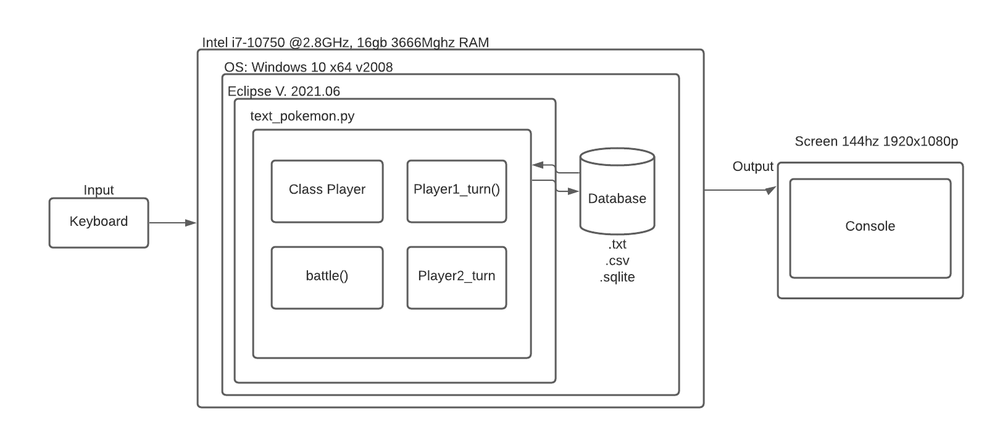
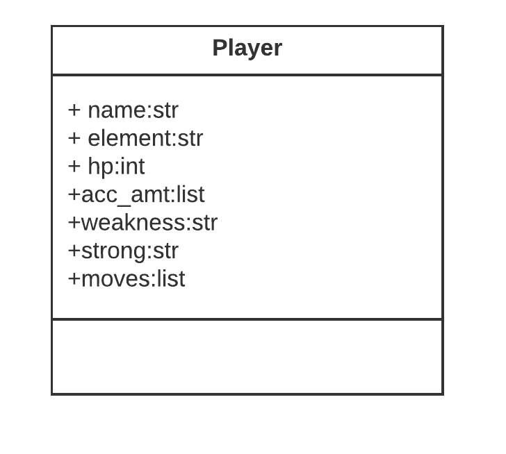
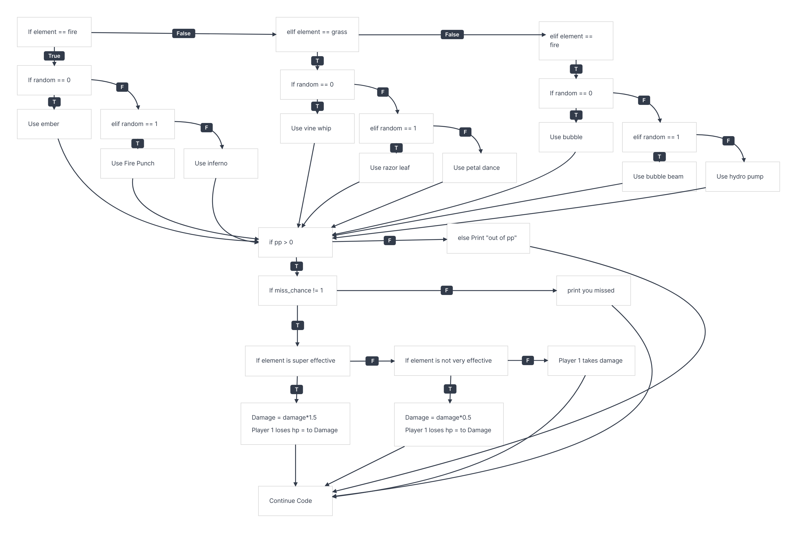
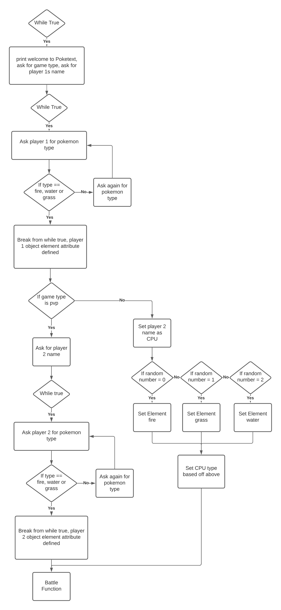
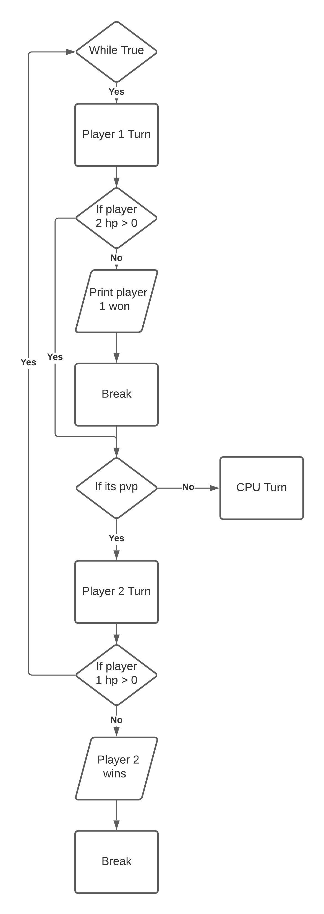

# Unit 1: A classic game 

# Criteria A: Planning

## Problem definition

The owner of the local game shop is an enthusiast of classic computer games. He has been looking for a talented programmer that can help him revive his passion for text-based games. He has few requirements for this task:

1. The game has to be entirely text-based.
2. The game must record the time played.
3. The game must record the player name and score.

Apart for this requirements, the owner is open to any type of game, topic or genre.

## Proposed Solution

I am going to create a Pokemon based text game, this will allow you to play against a freind on the same PC or against a CPU using the 3 base pokemon types of fire, water, and grass.

I will design and make a text based game for Mr. Ruben Pinzon. The game will be about pokemon and is constructed using the software python, running on the eclipse pydev IDE. It will take 2 weeks to make and will be evaluated according to the criteria shown below.

## Success Criteria
1. The game has to be entirely text-based.
2. The game must record the time played.
3. The game must record the player name and score.
4. Have the option of the three basic elements: fire, water, and grass, along with unique movesets for each element
5. Option for PvP or PvCPU
6. Database integration for numerous save states

# Criteria B: Design

## System Diagram

**Figure 1.** System Diagram for proposed text game

As shown in **Fig. 1**, the solution will run on python and is developed using the Eclipse IDE. The code it designed on windows but can run on a mac computer with python 3.0 installed as well.

## UML Diagram

**Figure 2.** UML Diagram for the player class

As shown in **Figure 2**, this is a UML diagram depicting my class 'player' that is used, along with the attributes associated with the class used.

## Flow Diagrams
**Figure 3**
Fig. 3 is a CPU Turn Function Flow Diagram, this depicts the method through which the CPU decided which move to use, based off of what element the CPU attribute is.

**Figure 4**
Fig 4 is a portion of code that sets up the game, namely by creating player objects based off the user inputs and game type.

**Figure 5**
Fig 5 is the function that itterates a battle until either side has lost:

## Record of Tasks
| Task No | Planned Action | Planned Outcome | Time estimate | Target completion date | Criterion |
|---|---|---|---|---|---|
| 1 | Work on CPU Action | Fix formatting, start theorizing how to calculate CPU actions | 2 Hours | September 19th | C |
| 2 | Finish CPU Implementation, consider something else? | Decided on inclusion of music or ascii images, finish CPU if else ladder | 2 Hours | September 20th | C |
| 3 | Comments and playtesting | Fill out comment descriptions for every function and if statements that are not clear | 1.5 Hours | September 21st | C |
| 4 | write out first system diagram, start second flowchart | Upload first system diagram | 30 mins | September 24th | B |
| 5 | Caesar Cypher encoder written out | Success | 30 mins | October 5th | C |
| 6 | Database caesar cypher implementation | Database is in Caesar cypher, TODO// get database to work  | 20 mins | October 5th | C |
| 7 | Battle function flow chart | Completed | 10 mins | October 7th | B |
| 8 | Fixed Battle Function chart | Fixed Loop | 10 Mins | October 22nd | B |
